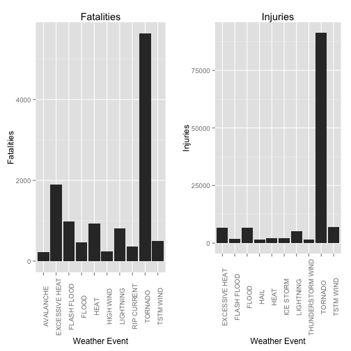
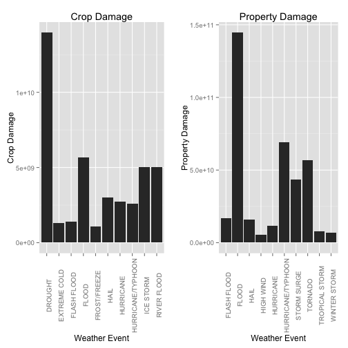

# SYNOPSIS

In this report, we will be exploring how extreme weather events effected public health and the economy during the history of the United States. These extreme weather events include tornados, floods, lightning and other inclement weather. In order to determine the public health consequences of each weather event, we will see how many injuries and fatalities were caused. When considering the immediate economic impact, we will see how much crop and property damage was caused by these events.

# PROCESSING DATA

### Setting Working Directory

The working directory is where you work when you are coding in R. Currently there is nothing in it. But when we start working, it is the place where we will save the downloaded data. All other work that is saved during the course of this report will also be saved in this directory.


```r
setwd("~/GitHub/Reproducible_Research_Assignment_2")
```

### Opening Packages to Be Used

These are the packages that will be used. The library command calls up the packages in the working directory. *dplyr* is used to manipulate the data. While *ggplot2* will be used to graph the data. Finally, *gridExtra* will be used so that multiple graphs can be put together.


```r
library(dplyr)
library(ggplot2)
library(gridExtra)
```


### Downloading and Storing Storm Data

Here, the data on Severe Weather Events in the United States is downloaded from the following URL. Once it is downloaded, it is saved in the working directory. Next, it is stored in the variable `storm_data`. From this point on in the report, `storm_data` will represent the Severe Weather data.


```r
if (!file.exists("StormData.csv.bz2")) {
    fileURL   <-  'https://d396qusza40orc.cloudfront.net/repdata%2Fdata%2FStormData.csv.bz2'
    download.file(fileURL, destfile="StormData.csv.bz2", method = "curl")
}
storm_data    <-  read.csv("StormData.csv.bz2")
```


#### Storm Data Summary

We check the summary of `storm_data` to get an idea of some of the parameters of the data.


```r
summary(storm_data)
```

```
##     STATE__                  BGN_DATE             BGN_TIME     
##  Min.   : 1.0   5/25/2011 0:00:00:  1202   12:00:00 AM: 10163  
##  1st Qu.:19.0   4/27/2011 0:00:00:  1193   06:00:00 PM:  7350  
##  Median :30.0   6/9/2011 0:00:00 :  1030   04:00:00 PM:  7261  
##  Mean   :31.2   5/30/2004 0:00:00:  1016   05:00:00 PM:  6891  
##  3rd Qu.:45.0   4/4/2011 0:00:00 :  1009   12:00:00 PM:  6703  
##  Max.   :95.0   4/2/2006 0:00:00 :   981   03:00:00 PM:  6700  
##                 (Other)          :895866   (Other)    :857229  
##    TIME_ZONE          COUNTY           COUNTYNAME         STATE       
##  CST    :547493   Min.   :  0.0   JEFFERSON :  7840   TX     : 83728  
##  EST    :245558   1st Qu.: 31.0   WASHINGTON:  7603   KS     : 53440  
##  MST    : 68390   Median : 75.0   JACKSON   :  6660   OK     : 46802  
##  PST    : 28302   Mean   :100.6   FRANKLIN  :  6256   MO     : 35648  
##  AST    :  6360   3rd Qu.:131.0   LINCOLN   :  5937   IA     : 31069  
##  HST    :  2563   Max.   :873.0   MADISON   :  5632   NE     : 30271  
##  (Other):  3631                   (Other)   :862369   (Other):621339  
##                EVTYPE         BGN_RANGE           BGN_AZI      
##  HAIL             :288661   Min.   :   0.000          :547332  
##  TSTM WIND        :219940   1st Qu.:   0.000   N      : 86752  
##  THUNDERSTORM WIND: 82563   Median :   0.000   W      : 38446  
##  TORNADO          : 60652   Mean   :   1.484   S      : 37558  
##  FLASH FLOOD      : 54277   3rd Qu.:   1.000   E      : 33178  
##  FLOOD            : 25326   Max.   :3749.000   NW     : 24041  
##  (Other)          :170878                      (Other):134990  
##          BGN_LOCATI                  END_DATE             END_TIME     
##               :287743                    :243411              :238978  
##  COUNTYWIDE   : 19680   4/27/2011 0:00:00:  1214   06:00:00 PM:  9802  
##  Countywide   :   993   5/25/2011 0:00:00:  1196   05:00:00 PM:  8314  
##  SPRINGFIELD  :   843   6/9/2011 0:00:00 :  1021   04:00:00 PM:  8104  
##  SOUTH PORTION:   810   4/4/2011 0:00:00 :  1007   12:00:00 PM:  7483  
##  NORTH PORTION:   784   5/30/2004 0:00:00:   998   11:59:00 PM:  7184  
##  (Other)      :591444   (Other)          :653450   (Other)    :622432  
##    COUNTY_END COUNTYENDN       END_RANGE           END_AZI      
##  Min.   :0    Mode:logical   Min.   :  0.0000          :724837  
##  1st Qu.:0    NA's:902297    1st Qu.:  0.0000   N      : 28082  
##  Median :0                   Median :  0.0000   S      : 22510  
##  Mean   :0                   Mean   :  0.9862   W      : 20119  
##  3rd Qu.:0                   3rd Qu.:  0.0000   E      : 20047  
##  Max.   :0                   Max.   :925.0000   NE     : 14606  
##                                                 (Other): 72096  
##            END_LOCATI         LENGTH              WIDTH         
##                 :499225   Min.   :   0.0000   Min.   :   0.000  
##  COUNTYWIDE     : 19731   1st Qu.:   0.0000   1st Qu.:   0.000  
##  SOUTH PORTION  :   833   Median :   0.0000   Median :   0.000  
##  NORTH PORTION  :   780   Mean   :   0.2301   Mean   :   7.503  
##  CENTRAL PORTION:   617   3rd Qu.:   0.0000   3rd Qu.:   0.000  
##  SPRINGFIELD    :   575   Max.   :2315.0000   Max.   :4400.000  
##  (Other)        :380536                                         
##        F               MAG            FATALITIES          INJURIES        
##  Min.   :0.0      Min.   :    0.0   Min.   :  0.0000   Min.   :   0.0000  
##  1st Qu.:0.0      1st Qu.:    0.0   1st Qu.:  0.0000   1st Qu.:   0.0000  
##  Median :1.0      Median :   50.0   Median :  0.0000   Median :   0.0000  
##  Mean   :0.9      Mean   :   46.9   Mean   :  0.0168   Mean   :   0.1557  
##  3rd Qu.:1.0      3rd Qu.:   75.0   3rd Qu.:  0.0000   3rd Qu.:   0.0000  
##  Max.   :5.0      Max.   :22000.0   Max.   :583.0000   Max.   :1700.0000  
##  NA's   :843563                                                           
##     PROPDMG          PROPDMGEXP        CROPDMG          CROPDMGEXP    
##  Min.   :   0.00          :465934   Min.   :  0.000          :618413  
##  1st Qu.:   0.00   K      :424665   1st Qu.:  0.000   K      :281832  
##  Median :   0.00   M      : 11330   Median :  0.000   M      :  1994  
##  Mean   :  12.06   0      :   216   Mean   :  1.527   k      :    21  
##  3rd Qu.:   0.50   B      :    40   3rd Qu.:  0.000   0      :    19  
##  Max.   :5000.00   5      :    28   Max.   :990.000   B      :     9  
##                    (Other):    84                     (Other):     9  
##       WFO                                       STATEOFFIC    
##         :142069                                      :248769  
##  OUN    : 17393   TEXAS, North                       : 12193  
##  JAN    : 13889   ARKANSAS, Central and North Central: 11738  
##  LWX    : 13174   IOWA, Central                      : 11345  
##  PHI    : 12551   KANSAS, Southwest                  : 11212  
##  TSA    : 12483   GEORGIA, North and Central         : 11120  
##  (Other):690738   (Other)                            :595920  
##                                                                                                                                                                                                     ZONENAMES     
##                                                                                                                                                                                                          :594029  
##                                                                                                                                                                                                          :205988  
##  GREATER RENO / CARSON CITY / M - GREATER RENO / CARSON CITY / M                                                                                                                                         :   639  
##  GREATER LAKE TAHOE AREA - GREATER LAKE TAHOE AREA                                                                                                                                                       :   592  
##  JEFFERSON - JEFFERSON                                                                                                                                                                                   :   303  
##  MADISON - MADISON                                                                                                                                                                                       :   302  
##  (Other)                                                                                                                                                                                                 :100444  
##     LATITUDE      LONGITUDE        LATITUDE_E     LONGITUDE_    
##  Min.   :   0   Min.   :-14451   Min.   :   0   Min.   :-14455  
##  1st Qu.:2802   1st Qu.:  7247   1st Qu.:   0   1st Qu.:     0  
##  Median :3540   Median :  8707   Median :   0   Median :     0  
##  Mean   :2875   Mean   :  6940   Mean   :1452   Mean   :  3509  
##  3rd Qu.:4019   3rd Qu.:  9605   3rd Qu.:3549   3rd Qu.:  8735  
##  Max.   :9706   Max.   : 17124   Max.   :9706   Max.   :106220  
##  NA's   :47                      NA's   :40                     
##                                            REMARKS           REFNUM      
##                                                :287433   Min.   :     1  
##                                                : 24013   1st Qu.:225575  
##  Trees down.\n                                 :  1110   Median :451149  
##  Several trees were blown down.\n              :   568   Mean   :451149  
##  Trees were downed.\n                          :   446   3rd Qu.:676723  
##  Large trees and power lines were blown down.\n:   432   Max.   :902297  
##  (Other)                                       :588295
```


#### Storm Data Heading
After that we check the heading of the data, in order to see how the data is listed in the columns and rows.


```r
head(storm_data)
```

```
##   STATE__           BGN_DATE BGN_TIME TIME_ZONE COUNTY COUNTYNAME STATE
## 1       1  4/18/1950 0:00:00     0130       CST     97     MOBILE    AL
## 2       1  4/18/1950 0:00:00     0145       CST      3    BALDWIN    AL
## 3       1  2/20/1951 0:00:00     1600       CST     57    FAYETTE    AL
## 4       1   6/8/1951 0:00:00     0900       CST     89    MADISON    AL
## 5       1 11/15/1951 0:00:00     1500       CST     43    CULLMAN    AL
## 6       1 11/15/1951 0:00:00     2000       CST     77 LAUDERDALE    AL
##    EVTYPE BGN_RANGE BGN_AZI BGN_LOCATI END_DATE END_TIME COUNTY_END
## 1 TORNADO         0                                               0
## 2 TORNADO         0                                               0
## 3 TORNADO         0                                               0
## 4 TORNADO         0                                               0
## 5 TORNADO         0                                               0
## 6 TORNADO         0                                               0
##   COUNTYENDN END_RANGE END_AZI END_LOCATI LENGTH WIDTH F MAG FATALITIES
## 1         NA         0                      14.0   100 3   0          0
## 2         NA         0                       2.0   150 2   0          0
## 3         NA         0                       0.1   123 2   0          0
## 4         NA         0                       0.0   100 2   0          0
## 5         NA         0                       0.0   150 2   0          0
## 6         NA         0                       1.5   177 2   0          0
##   INJURIES PROPDMG PROPDMGEXP CROPDMG CROPDMGEXP WFO STATEOFFIC ZONENAMES
## 1       15    25.0          K       0                                    
## 2        0     2.5          K       0                                    
## 3        2    25.0          K       0                                    
## 4        2     2.5          K       0                                    
## 5        2     2.5          K       0                                    
## 6        6     2.5          K       0                                    
##   LATITUDE LONGITUDE LATITUDE_E LONGITUDE_ REMARKS REFNUM
## 1     3040      8812       3051       8806              1
## 2     3042      8755          0          0              2
## 3     3340      8742          0          0              3
## 4     3458      8626          0          0              4
## 5     3412      8642          0          0              5
## 6     3450      8748          0          0              6
```


#### Summary and List of Storm Event Types
Finally, we take a look at the different kinds of weather events that are listed in `storm_data`. Although there are plenty listed here, this report focuses on the events that caused the most economic and public health damage. 


```r
summary(storm_data$EVTYPE)
```

```
##                     HAIL                TSTM WIND        THUNDERSTORM WIND 
##                   288661                   219940                    82563 
##                  TORNADO              FLASH FLOOD                    FLOOD 
##                    60652                    54277                    25326 
##       THUNDERSTORM WINDS                HIGH WIND                LIGHTNING 
##                    20843                    20212                    15754 
##               HEAVY SNOW               HEAVY RAIN             WINTER STORM 
##                    15708                    11723                    11433 
##           WINTER WEATHER             FUNNEL CLOUD         MARINE TSTM WIND 
##                     7026                     6839                     6175 
## MARINE THUNDERSTORM WIND               WATERSPOUT              STRONG WIND 
##                     5812                     3796                     3566 
##     URBAN/SML STREAM FLD                 WILDFIRE                 BLIZZARD 
##                     3392                     2761                     2719 
##                  DROUGHT                ICE STORM           EXCESSIVE HEAT 
##                     2488                     2006                     1678 
##               HIGH WINDS         WILD/FOREST FIRE             FROST/FREEZE 
##                     1533                     1457                     1342 
##                DENSE FOG       WINTER WEATHER/MIX           TSTM WIND/HAIL 
##                     1293                     1104                     1028 
##  EXTREME COLD/WIND CHILL                     HEAT                HIGH SURF 
##                     1002                      767                      725 
##           TROPICAL STORM           FLASH FLOODING             EXTREME COLD 
##                      690                      682                      655 
##            COASTAL FLOOD         LAKE-EFFECT SNOW        FLOOD/FLASH FLOOD 
##                      650                      636                      624 
##                LANDSLIDE                     SNOW          COLD/WIND CHILL 
##                      600                      587                      539 
##                      FOG              RIP CURRENT              MARINE HAIL 
##                      538                      470                      442 
##               DUST STORM                AVALANCHE                     WIND 
##                      427                      386                      340 
##             RIP CURRENTS              STORM SURGE            FREEZING RAIN 
##                      304                      261                      250 
##              URBAN FLOOD     HEAVY SURF/HIGH SURF        EXTREME WINDCHILL 
##                      249                      228                      204 
##             STRONG WINDS           DRY MICROBURST    ASTRONOMICAL LOW TIDE 
##                      196                      186                      174 
##                HURRICANE              RIVER FLOOD               LIGHT SNOW 
##                      174                      173                      154 
##         STORM SURGE/TIDE            RECORD WARMTH         COASTAL FLOODING 
##                      148                      146                      143 
##               DUST DEVIL         MARINE HIGH WIND        UNSEASONABLY WARM 
##                      141                      135                      126 
##                 FLOODING   ASTRONOMICAL HIGH TIDE        MODERATE SNOWFALL 
##                      120                      103                      101 
##           URBAN FLOODING               WINTRY MIX        HURRICANE/TYPHOON 
##                       98                       90                       88 
##            FUNNEL CLOUDS               HEAVY SURF              RECORD HEAT 
##                       87                       84                       81 
##                   FREEZE                HEAT WAVE                     COLD 
##                       74                       74                       72 
##              RECORD COLD                      ICE  THUNDERSTORM WINDS HAIL 
##                       64                       61                       61 
##      TROPICAL DEPRESSION                    SLEET         UNSEASONABLY DRY 
##                       60                       59                       56 
##                    FROST              GUSTY WINDS      THUNDERSTORM WINDSS 
##                       53                       53                       51 
##       MARINE STRONG WIND                    OTHER               SMALL HAIL 
##                       48                       48                       47 
##                   FUNNEL             FREEZING FOG             THUNDERSTORM 
##                       46                       45                       45 
##       Temperature record          TSTM WIND (G45)         Coastal Flooding 
##                       43                       39                       38 
##              WATERSPOUTS    MONTHLY PRECIPITATION                    WINDS 
##                       37                       36                       36 
##                  (Other) 
##                     2940
```


### Assigning Variables 
In this section we will be assigning variables to be used in the R Coding. This step makes the data easy to use. Also it is a great way to demonstrate the steps used to build our plots. 

#### Event

The different weather events from `storm_data` are stored in the variable `event`.

```r
event                 <-  storm_data$EVTYPE
```
#### Fatalities
Here the fatalities from each weather event in `storm_data` are stored in the variable `fatalities`. Next the variable `sum_fatalities` is created. `sum_fatalities` is the sum of all the `fatalities` caused by each `event`. Finally, we create `top_10_fatalities`, which is a variable where the top ten fatalities are ordered and listed.

```r
fatalities            <-  storm_data$FATALITIES
sum_fatalities        <-  aggregate(fatalities~event, storm_data, sum, na.rm=TRUE)
top_10_fatalities     <-  sum_fatalities[order(-sum_fatalities$fatalities), ][1:10, ]
```
#### Injuries
The same process used to create `fatalities`, `sum_fatalities`, and `top_10_fatalities` are used to create the variables `injuries`, `sum_injuries`, and `top_10_injuries`.  
  
These two sets of variables are used to determine the cost to public health from each weather event.

```r
injuries              <-  storm_data$INJURIES
sum_injuries          <-  aggregate(injuries~event, storm_data, sum, na.rm=TRUE)
top_10_injuries       <-  sum_injuries[order(-sum_injuries$injuries), ][1:10, ]
```
#### Crop Exponent
Our next step is to figure out the economic damage. So we will look at the cost of property damage and crop damage caused by each weather event. From the data in `storm_data` we see that crop damage and property damage are listed with an accompanying exponent. These exponents are "H", "K", "M", and "B", which respectively denote hundreds, thousands, millions, and billions of dollars.   
  
So we create the variable `crop_exponent`, which is a list of all the crop damage exponents listed in `storm_data`. Next we tell R to read `crop_exponent` as a character. After that we tell R to change "H" to "2", "K" to "3", "M" to "6", and "B" to "9". These numbers correspond to the exponential power represented by each letter. The next step in our code tells R to return any data not listed as an "H", "K", "M", or "B" in `crop_exponent` as a "0". The final code tells R to read `crop_exponent` as a numeric.

```r
crop_exponent         <-  storm_data$CROPDMGEXP
crop_exponent         <-  as.character(crop_exponent)
crop_exponent[toupper(crop_exponent) == "H"]  <-  "2"
crop_exponent[toupper(crop_exponent) == "K"]  <-  "3"
crop_exponent[toupper(crop_exponent) == "M"]  <-  "6"
crop_exponent[toupper(crop_exponent) == "B"]  <-  "9"
crop_exponent[is.na(crop_exponent)]           <-  "0"
crop_exponent         <-  as.numeric(crop_exponent)
```

```
## Warning: NAs introduced by coercion
```
#### Crop Damage
This next section is a follow up to the previous section. All crop damage listed in `storm_data` is listed with a crop damage number value and a crop damage exponent. The crop damage exponents were all manipulated and stored in the variable `crop_exponent` in the previous section.  
  
Here we manipulate the data listed in the column crop damage and store it in the variable `crop_damage`. Next we multiply the values stored in `crop_damage` by 10 raised to the exponent stored in the variable `crop_exponent`. This gives us the total value of the crop damage listed in `storm_data`. This value is stored in the variable `crop_damage`, which replaces its previous value. Next we add up all the `crop_damage` listed in `storm_data` by weather event. This value is stored in the variable `sum_crop_damage`. After this we tell R to list the top 10 causes of `crop_damage` caused by weather event and store it in the variable `top_10_crop`.

```r
crop_damage           <-  storm_data$CROPDMG
crop_damage           <-  crop_damage  * 10^crop_exponent
sum_crop_damage       <-  aggregate(crop_damage~event, storm_data, sum, na.rm=TRUE)
top_10_crop           <-  sum_crop_damage[order(-sum_crop_damage$crop_damage), ][1:10, ]
```
#### Property Exponent
The same process used to create the variable `crop_exponent` is used to create the variable `property_exponent`.

```r
property_exponent     <-  storm_data$PROPDMGEXP
property_exponent     <-  as.character(property_exponent)
property_exponent[toupper(property_exponent) == "H"]    <-  "2"
property_exponent[toupper(property_exponent) == "K"]    <-  "3"
property_exponent[toupper(property_exponent) == "M"]    <-  "6"
property_exponent[toupper(property_exponent) == "B"]    <-  "9"
property_exponent[is.na(property_exponent)]             <-  "0"
property_exponent     <-  as.numeric(property_exponent)
```

```
## Warning: NAs introduced by coercion
```
#### Property Damage
The same process used to create the variables `crop_damage`, `sum_crop_damage` and `top_10_crop` are used to create the variables `property_damage`, `sum_property_damage` and `top_10_property`. This gives us the top 10 causes of property damage for weather events in `storm_data`.

```r
property_damage       <-  storm_data$PROPDMG
property_damage       <-  property_damage * 10^property_exponent
sum_property_damage   <-  aggregate(property_damage~event, storm_data, sum, na.rm=TRUE)
top_10_property       <- sum_property_damage[order(-sum_property_damage$property_damage), ][1:10, ]
```


# RESULTS

### Weather Events with Highest Health Consequences (Fatalities and Injuries)

In this section we will look at the results of the data analyis of `storm_data`. By the end, we will see the top 10 weather events that cause `fatalities`, `injuries`, `crop_damage` and `property_damage`. This analysis will show us the impact on public health and immediate economic consequences caused by each weather event.

#### Fatalities from Weather Events

Here we tell R to display the variable `top_10_fatalities`, which tells us which weather events caused the most fatalities. 


```r
top_10_fatalities
```

```
##              event fatalities
## 834        TORNADO       5633
## 130 EXCESSIVE HEAT       1903
## 153    FLASH FLOOD        978
## 275           HEAT        937
## 464      LIGHTNING        816
## 856      TSTM WIND        504
## 170          FLOOD        470
## 585    RIP CURRENT        368
## 359      HIGH WIND        248
## 19       AVALANCHE        224
```
#### Injuries from Weather Events

Next we tell R to show the variable `top_10_injuries`, which shows which weather events caused the most injuries. 


```r
top_10_injuries
```

```
##                 event injuries
## 834           TORNADO    91346
## 856         TSTM WIND     6957
## 170             FLOOD     6789
## 130    EXCESSIVE HEAT     6525
## 464         LIGHTNING     5230
## 275              HEAT     2100
## 427         ICE STORM     1975
## 153       FLASH FLOOD     1777
## 760 THUNDERSTORM WIND     1488
## 244              HAIL     1361
```
#### Graphs for Fatalities and Injuries from Weather Events

Next we use the ggplot command in R to graph the data stored in `top_10_fatalities` and `top_10_injuries` as bar graphs. The first one shows how many `fatalities` were caused by each weather event. The next one shows the amount of `injuries` caused by each weather event. The code shows how each graph was labeled. It also shows how the weather events listed in the x-axis are made to be at a 90 degree angle. These graphs are stored in the variables `fatalities_graph` and `injuries_graph`. Finally the graphs stored in the variables `fatalities_graph` and `injuries_graph` are used as arguments in the command `grid.arrange` along with an argument `ncol=2`, which tell the command `grid.arrange` to use two columns. These arguments in the command `grid.arrange` make the two graphs be put together side by side.

```r
fatalities_graph  <-  ggplot(top_10_fatalities, aes(event, fatalities)) + geom_bar(stat="identity") + labs(title="Fatalities", x="Weather Event", y="Fatalities") + theme(axis.text.x=element_text(angle=90))

injuries_graph    <-  ggplot(top_10_injuries, aes(event, injuries)) + geom_bar(stat="identity") + labs(title="Injuries", x="Weather Event", y="Injuries") + theme(axis.text.x=element_text(angle=90))

grid.arrange(fatalities_graph, injuries_graph, ncol=2)
```

 

### Weather Events with Largest Economic Consequences (Crop and Property Damage)

#### Crop Damages from Weather Events

Here we display the variable `top_10_crop` which shows us which weather events caused the most crop damage.


```r
top_10_crop
```

```
##                event crop_damage
## 16           DROUGHT 13972566000
## 34             FLOOD  5661968450
## 98       RIVER FLOOD  5029459000
## 85         ICE STORM  5022113500
## 52              HAIL  3025954470
## 77         HURRICANE  2741910000
## 82 HURRICANE/TYPHOON  2607872800
## 30       FLASH FLOOD  1421317100
## 26      EXTREME COLD  1292973000
## 46      FROST/FREEZE  1094086000
```
#### Property Damages from Weather Events

Then we display `top_10_property`, which shows which weather events caused the most property damage.


```r
top_10_property
```

```
##                 event property_damage
## 62              FLOOD    144657709800
## 179 HURRICANE/TYPHOON     69305840000
## 333           TORNADO     56947380614
## 281       STORM SURGE     43323536000
## 50        FLASH FLOOD     16822673772
## 103              HAIL     15735267456
## 171         HURRICANE     11868319010
## 341    TROPICAL STORM      7703890550
## 400      WINTER STORM      6688497251
## 156         HIGH WIND      5270046260
```
#### Graphs for Crop Damages and Property Damages from Weather Events

In this section we use the process used to put together the graphs of the weather events that caused the most fatalites and injuries to make graphs that show which weather events caused the most crop and property damage. 

```r
crop_graph      <-  ggplot(top_10_crop, aes(event, crop_damage)) + geom_bar(stat="identity") + theme(axis.text.x=element_text(angle=90)) + labs(title="Crop Damage", x="Weather Event", y="Crop Damage")

property_graph  <-  ggplot(top_10_property, aes(event, property_damage)) + geom_bar(stat="identity") + theme(axis.text.x=element_text(angle=90)) + labs(title="Property Damage", x="Weather Event", y="Property Damage")

grid.arrange(crop_graph, property_graph, ncol=2)
```

 

#CONCLUSION

From the data that was stored in `storm_data` we can see which weather events had the most immediate economic and public health consequences. We see that tornados caused the most `fatalities` and `injuries`. Not only did they cause the most damage to public health, but they beat out the next weather events by far. From the results we see that droughts cause the most crop damage and floods cause the most property damage. Therefore, the weather event that has the biggest immediate economic consequences differs with respect to crop damage and property damage.

